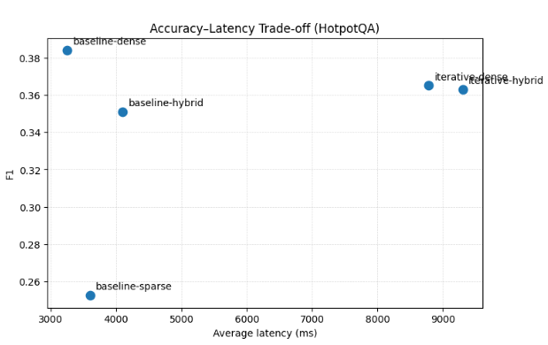

# Retrieval Optimization for Enhanced Groundedness in RAG Systems  
**Suwen Wang (sw6359), Yiheng Chen (yc7766)**  
**Course Final Project Report (Draft)**  
**Date:** 2025-12-23

---

## Abstract
Retrieval-Augmented Generation (RAG) systems mitigate hallucination in large language models (LLMs) by grounding generation on retrieved evidence. In this project, we systematically evaluate retrieval-side optimizations for groundedness and answer quality across both single-hop (SQuAD) and multi-hop QA (HotpotQA). We implement a unified experimental pipeline supporting baseline RAG with sparse/dense/hybrid retrieval, a cross-encoder re-ranking stage, iterative (multi-step) retrieval, and an adaptive retrieval variant. Experiments on 100-query subsets show: (1) evidence precision is more important than raw recall for single-hop QA, as re-ranking yields consistent EM/F1 and faithfulness improvements with minimal latency; (2) multi-hop QA remains challenging even with strong retrieval metrics, indicating reasoning/evidence integration is the bottleneck; (3) naive multi-step retrieval increases cost substantially while providing limited benefit. Overall, re-ranking provides the best accuracy–latency tradeoff in our study.

---

## 1. Introduction
Large language models are prone to hallucination and often fail on queries requiring exact, domain-specific, or long-tail factual knowledge. Retrieval-Augmented Generation (RAG) addresses this by retrieving relevant evidence from an external corpus and conditioning generation on that evidence. However, RAG performance depends critically on retrieval strategies and how retrieved context is filtered and presented to the generator.

This project focuses on **retrieval optimization** to improve groundedness and final answer quality. We ask:
- When does improving retrieval (e.g., recall) translate into better QA?
- Do precision-oriented techniques (e.g., re-ranking) improve groundedness more effectively than adding more context?
- What happens on multi-hop QA, where multiple pieces of evidence must be integrated?

---

## 2. System Overview
We implement a modular RAG pipeline with interchangeable retrieval and reasoning components. All experiments use the same generator backend and standardized evaluation pipeline.

### 2.1 Components
- **Retriever**
  - **Sparse**: BM25
  - **Dense**: embedding-based dense retriever implemented with Sentence-Transformers (default embedding model: `BAAI/bge-base-en-v1.5`) and optional FAISS indexing
  - **Hybrid**: fusion of sparse + dense retrieval via rank fusion (Reciprocal Rank Fusion / weighted fusion)
- **Generator**
  - OpenAI backend, model: `gpt-5-mini` (the codebase also supports a local HuggingFace backend)
- **Pipelines**
  - **Baseline RAG**: retrieve top-*k* chunks → generate answer once
  - **Re-ranking RAG**: retrieve candidates → cross-encoder rerank → take top-*k* → generate
  - **Iterative RAG**: multi-step retrieval + generation loop (avg 3 LLM calls)
  - **Adaptive Retrieval**: a two-call variant that adjusts behavior dynamically (avg 2 LLM calls)

### 2.2 Experimental Settings
- Subset size: **100 examples** per dataset per run
- Retrieval depth: `top_k = 5`
- Max generation tokens: 
  - **SQuAD**: 256  
  - **HotpotQA**: 512  
- Metrics:
  - **Retrieval**: MRR, Precision@k, Recall@k, nDCG@k
  - **QA**: Exact Match (EM), F1
  - **RAG** (Ragas-style): Faithfulness, Answer Relevancy, Context Precision
  - **System**: latency (ms), number of LLM calls, token usage

---

## 3. Datasets
We evaluate on two QA datasets representing different reasoning demands:

- **SQuAD**: primarily single-hop factoid questions with localized answer spans.
- **HotpotQA**: multi-hop questions requiring combining evidence across multiple supporting facts.

---

## 4. Methods
### 4.1 Baseline RAG
We compare sparse, dense, and hybrid retrieval within a standard single-step RAG framework:
1. Retrieve top-*k* documents/chunks
2. Concatenate as context
3. Generate an answer

### 4.2 Re-ranking RAG
We add a cross-encoder re-ranking stage:
1. Retrieve an initial candidate set
2. Apply cross-encoder scoring to reorder candidates
3. Keep top-*k* for generation

This aims to improve evidence precision and suppress noisy passages.

### 4.3 Iterative RAG
We implement a naive multi-step loop:
- retrieve → draft → retrieve again conditioned on draft → refine

This increases retrieval opportunities for multi-hop questions but also raises cost.

### 4.4 Adaptive Retrieval (Current Implementation)
We evaluate an adaptive pipeline which triggers additional decision-making and increases average LLM calls to 2. The current variant shows modest improvements but higher latency, motivating future cost-matched designs.

---

## 5. Results

### 5.1 Baseline RAG Performance

#### SQuAD (Baseline, top-k=5, max_tokens=256)
| Retriever | MRR | P@1 | Recall@5 | EM | F1 | Faithfulness | Context Precision | Avg Latency |
|---|---:|---:|---:|---:|---:|---:|---:|---:|
| Sparse | 0.2920 | 0.28 | 0.32 | 0.49 | 0.5527 | 0.7423 | 0.6012 | 2.24s |
| Dense  | 0.2712 | 0.18 | 0.39 | 0.64 | 0.7436 | 0.9413 | 0.7597 | 2.20s |
| Hybrid | 0.3095 | 0.28 | 0.36 | 0.59 | 0.6741 | 0.8550 | 0.6943 | 2.35s |

**Observations (SQuAD):**
- Dense retrieval yields substantially higher QA accuracy (EM/F1) and faithfulness than sparse BM25, despite BM25 having higher P@1.
- Hybrid improves retrieval metrics (MRR, nDCG, recall) but does not consistently improve QA accuracy, suggesting that increased recall can introduce noisy context.

#### HotpotQA (Baseline, top-k=5, max_tokens=512)
| Retriever | MRR | P@1 | Recall@5 | EM | F1 | Faithfulness | Context Precision | Avg Latency |
|---|---:|---:|---:|---:|---:|---:|---:|---:|
| Dense  | 0.6815 | 0.59 | 0.1644 | 0.28 | 0.3840 | 0.5043 | 0.4859 | 3.25s |
| Sparse | 0.7428 | 0.67 | 0.2051 | 0.18 | 0.2524 | 0.3763 | 0.4236 | 3.60s |
| Hybrid | 0.7490 | 0.66 | 0.2102 | 0.25 | 0.3511 | 0.4654 | 0.5000 | 4.10s |

**Observations (HotpotQA):**
- Retrieval metrics are relatively strong (MRR ≈ 0.68–0.75), yet QA accuracy remains low (F1 ≤ 0.38).
- This indicates retrieval is not the main bottleneck; multi-hop questions likely fail due to reasoning and evidence integration.

---

### 5.2 Effect of Re-ranking (SQuAD)

| Pipeline | Retriever | EM | F1 | Faithfulness | Context Precision | Avg Latency |
|---|---|---:|---:|---:|---:|---:|
| Baseline | Dense | 0.64 | 0.7436 | 0.9413 | 0.7597 | 2.20s |
| Re-rank  | Dense | 0.68 | 0.7701 | 0.9571 | 0.8114 | 2.36s |
| Re-rank  | Hybrid | 0.69 | 0.7888 | 0.9487 | 0.8170 | 2.21s |

**Key finding:**  
Re-ranking yields the most cost-effective improvement:
- Dense + re-ranking improves F1 **0.744 → 0.770** and faithfulness **0.941 → 0.957** with only ~0.16s added latency.
- Hybrid + re-ranking achieves the best F1 (**0.789**) and strong context precision.

**Interpretation:**  
For single-hop QA, **evidence precision dominates evidence quantity**. Re-ranking effectively suppresses weakly relevant passages, improving both correctness and groundedness.

---

### 5.3 Iterative RAG on Multi-hop QA (HotpotQA)

| Pipeline | Retriever | EM | F1 | Faithfulness | Avg Latency | Avg LLM Calls |
|---|---|---:|---:|---:|---:|---:|
| Baseline | Dense | 0.28 | 0.3840 | 0.5043 | 3.25s | 1.0 |
| Iterative | Dense | 0.27 | 0.3651 | 0.5378 | 8.78s | 3.0 |
| Iterative | Hybrid | 0.27 | 0.3630 | 0.5140 | 9.30s | 3.0 |

**Key finding:**  
Naive iterative RAG increases cost ~3× but does not improve EM/F1.

**Interpretation:**  
Iterative retrieval alone is insufficient for multi-hop QA without structured reasoning guidance (e.g., query decomposition, explicit intermediate supervision, or evidence linking).

---

### 5.4 Adaptive Retrieval (SQuAD, Dense)

| Metric | Baseline Dense | Adaptive Dense |
|---|---:|---:|
| EM | 0.64 | 0.66 |
| F1 | 0.7436 | 0.7383 |
| Faithfulness | 0.9413 | 0.9260 |
| Answer Relevancy | 0.3722 | 0.3852 |
| Avg Latency | 2.20s | 3.28s |
| Avg LLM Calls | 1.0 | 2.0 |

**Key finding:**  
Adaptive retrieval shows modest EM and answer relevancy gains but increases latency and slightly reduces faithfulness.

**Interpretation:**  
The current adaptive design appears to affect generation behavior more than retrieval quality. Future work should enforce cost-matching (e.g., 1-call adaptive-k, early stopping, or budgeted retrieval) to improve groundedness-per-latency.

---

### 5.5 Accuracy–Latency Tradeoff (Visualization)

To better illustrate the practical cost–performance frontier, we plot F1 versus average end-to-end latency for each pipeline.

#### 5.5.1 SQuAD: Single-hop QA Tradeoff

**Figure 1.** Accuracy–latency trade-off on SQuAD (F1 vs. average latency). Points correspond to:
baseline-{sparse,dense,hybrid}, rerank-{dense,hybrid}, and adaptive-dense.

**Takeaways (SQuAD).**
- **Re-ranking is on the Pareto frontier.** Both `rerank-dense` and `rerank-hybrid` achieve the highest F1 (≈0.77–0.79) with only a small latency increase relative to baseline (≈2.2–2.4s).
- **Hybrid baseline increases retrieval quality but not end QA quality.** `baseline-hybrid` sits below `baseline-dense` in F1 while being slightly slower, consistent with the hypothesis that additional context can introduce noise without strong filtering.
- **Adaptive-dense is not cost-effective in its current form.** It shows roughly baseline-level F1 at substantially higher latency (~3.3s), suggesting the current adaptive design trades extra calls/time for limited quality gain.

---

#### 5.5.2 HotpotQA: Multi-hop QA Tradeoff

**Figure 2.** Accuracy–latency trade-off on HotpotQA (F1 vs. average latency). Points correspond to:
baseline-{sparse,dense,hybrid} and iterative-{dense,hybrid}.

**Takeaways (HotpotQA).**
- **Baseline dense is the best overall trade-off.** It achieves the highest F1 (~0.38) at the lowest latency among competitive methods (~3.2s).
- **Naive iterative retrieval is dominated.** `iterative-dense` and `iterative-hybrid` are ~3× slower (~8.8–9.3s) but do not improve F1 (≈0.36), indicating that simply “retrieving more in more steps” does not solve multi-hop reasoning.
- **The bottleneck is reasoning/evidence integration, not recall.** Even when retrieval metrics are strong, multi-hop QA remains difficult without structured decomposition or explicit evidence linking.

---

## 6. Discussion
### 6.1 Better retrieval ≠ better answers
On SQuAD, hybrid retrieval improves recall and nDCG but does not consistently improve EM/F1. This supports the hypothesis that adding context can introduce noise, and the generator may not reliably filter weak evidence.

### 6.2 Evidence quality is the strongest lever
Re-ranking consistently improves answer quality and faithfulness at minimal latency overhead. This is the clearest win in our experiments, suggesting that retrieval precision is more impactful than raw recall for single-hop factual QA.

### 6.3 Multi-hop QA bottleneck: reasoning + evidence integration
HotpotQA shows strong retrieval scores but low EM/F1. Iterative retrieval adds cost but yields limited improvements, implying that multi-hop failures require better reasoning scaffolds (e.g., decomposition into sub-queries, explicit intermediate evidence selection, or structured multi-step prompting).

---

## 7. Limitations
- Small evaluation size (100 examples per run) increases variance and limits statistical confidence.
- Single generator model (`gpt-5-mini`) may bias results; different LLMs may respond differently to context noise.
- The iterative and adaptive pipelines are currently naive implementations; stronger guided multi-hop strategies were not yet tested.
- Metric definitions (especially recall on multi-evidence datasets) require careful documentation in the final version.

---

## 8. Future Work
- **Budget-matched evaluation:** compare adaptive vs baseline under equal LLM-call or latency budgets.
- **Guided multi-hop retrieval:** query decomposition or entity-driven second-hop retrieval for HotpotQA.
- **Unified strongest baseline on open-domain:** run hybrid + re-ranking on BRIGHT and analyze domain robustness.
- **Calibration-based stopping:** early stopping based on reranker confidence or retrieval score gaps.
- **Error analysis:** categorize failure modes (missing evidence vs conflicting evidence vs reasoning failure).

---

## 9. Conclusion
This project evaluates retrieval-side optimizations for groundedness in RAG systems. We find that:
1. For single-hop QA (SQuAD), re-ranking is the most effective and cost-efficient improvement, boosting both EM/F1 and faithfulness with minimal latency overhead.
2. For multi-hop QA (HotpotQA), retrieval quality alone is not sufficient; reasoning and evidence integration dominate performance.
3. Naive iterative retrieval increases cost substantially without improving QA accuracy, and adaptive retrieval currently offers modest gains but needs better budget alignment.

Overall, **precision-oriented retrieval filtering (re-ranking)** is the most reliable lever for improving groundedness under practical latency constraints.

---

## Appendix A: Raw Command Logs (Provided)
Experiments were executed using:
- `python scripts/run_experiment.py --dataset squad --pipeline baseline --retriever {dense|sparse|hybrid} --max_tokens 256`
- `python scripts/run_experiment.py --dataset hotpotqa --pipeline baseline --retriever {dense|sparse|hybrid} --max_tokens 512`
- `python scripts/run_experiment.py --dataset squad --pipeline rerank --retriever {dense|hybrid} --max_tokens 256`
- `python scripts/run_experiment.py --dataset hotpotqa --pipeline iterative --retriever {dense|hybrid} --max_tokens 512`
- `python scripts/run_experiment.py --dataset squad --pipeline adaptive --retriever dense --max_tokens 256`

Timestamps and JSON outputs are included in the experiment logs.

---
